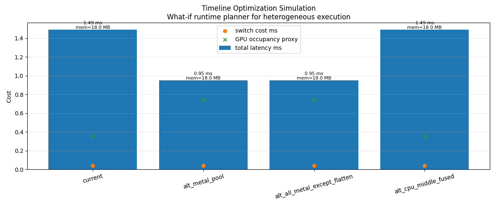
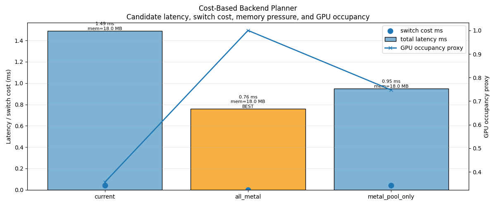
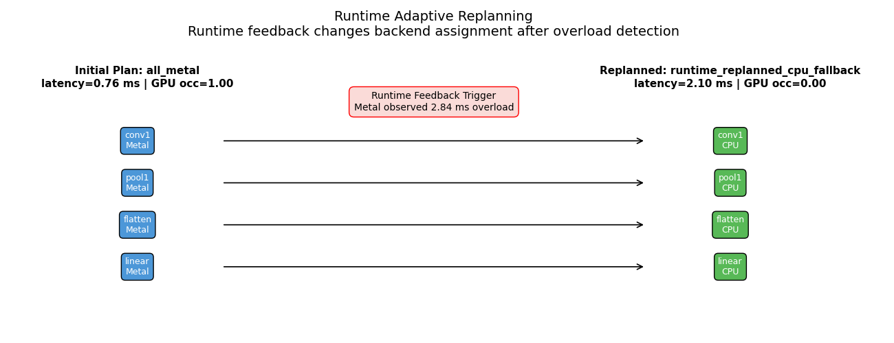
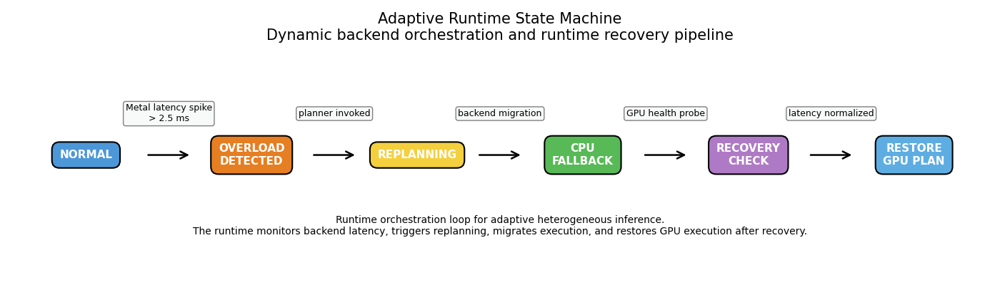

## CV Graph Compiler and Runtime Infrastructure

Implemented a compiler-runtime simulation pipeline for CV-oriented heterogeneous inference execution, backend-aware scheduling, graph lowering, memory planning, adaptive runtime orchestration, and runtime-feedback-driven execution replanning.

Implemented compiler-runtime infrastructure inspired by:

- TensorRT
- XLA
- TVM
- MLIR-based runtimes
- heterogeneous inference runtimes
- LLM compiler/runtime planning systems

### CV Graph Pipeline

Implemented a CV inference graph including:

```text
Conv2D
    →
BatchNorm
    →
ReLU
    →
MaxPool
    →
Flatten
    →
Linear
```

Implemented graph-level compiler optimization passes including:

- ShapeInferencePass
- CanonicalizationPass
- DTypePropagationPass
- FusionCandidatePass
- MemoryPlanningPass
- BackendPlacementPass
- SchedulingPass

Implemented backend-aware graph lowering into:

- LoweredGraph IR
- ExecutionPlan IR
- StaticExecutionSchedule

Generated artifacts:

- [cv_lowered_graph.json](trace/cv_lowered_graph.json)
- [cv_execution_plan_v2.json](trace/cv_execution_plan_v2.json)
- [cv_static_schedule.json](trace/cv_static_schedule.json)

### CV Graph Fusion Analysis

Implemented compiler-side fusion analysis and graph rewrite infrastructure for CV inference optimization.

Implemented fusion rewrite:

```text
Conv2D + BatchNorm + ReLU
    →
FusedConvBatchNormReLU
```

Implemented:

- fusion-candidate analysis
- graph rewrite infrastructure
- fused-op lowering
- fused execution scheduling
- fusion-aware runtime planning

Example compiler rewrite:

```text
rewriting:
Conv2D + BatchNorm + ReLU
    →
FusedConvBatchNormReLU
```

This simulates lightweight fusion infrastructure used in production ML compilers and inference runtimes.

### Tensor Lifetime and Memory Planning

Implemented compiler-side tensor lifetime analysis and runtime memory-reuse planning.

Implemented:

- activation lifetime tracking
- persistent tensor analysis
- buffer reuse planning
- memory-offset assignment
- runtime memory reuse
- peak-memory estimation
- activation reuse analysis

Example memory reuse behavior:

```text
relu_out reuses buffer from conv_out
pool_out reuses buffer from conv_out
flat_out reuses buffer from conv_out
logits reuses buffer from conv_out
```

Example memory-planning result:

```text
Naive memory:
4882250 float elements

Planned peak memory:
3699424 float elements

Saved memory:
1182826 float elements
```

Generated artifacts:

- [cv_memory_plan.json](trace/cv_memory_plan.json)

This simulates lightweight runtime-memory planning infrastructure used in heterogeneous inference runtimes and serving systems.

### Backend Placement and Heterogeneous Scheduling

Implemented heterogeneous backend-placement analysis and runtime execution scheduling.

Implemented backend placement including:

- CPU execution
- Metal execution
- MockGPU execution

Implemented:

- backend-aware lowering
- dependency-aware scheduling
- backend transition analysis
- execution-plan generation
- execution timeline simulation
- heterogeneous runtime orchestration

Example execution schedule:

```text
[0] conv1 | FusedConvBatchNormReLU | backend=Metal
[1] pool1 | MaxPool | backend=CPU
[2] flatten | Flatten | backend=CPU
[3] linear | Linear | backend=Metal
```

Generated artifacts:

- [cv_static_schedule.json](trace/cv_static_schedule.json)
- [cv_runtime_timeline.json](trace/cv_runtime_timeline.json)

### Subgraph Partitioning

Implemented backend-aware subgraph partitioning for heterogeneous inference execution.

Implemented:

- backend-oriented graph partitioning
- execution-region grouping
- backend execution segmentation
- runtime migration-region analysis

Example partitioning result:

```text
subgraph 0 | backend=Metal | ops=conv1
subgraph 1 | backend=CPU | ops=pool1 flatten
subgraph 2 | backend=Metal | ops=linear
```

Generated artifacts:

- [cv_subgraph_partition.json](trace/cv_subgraph_partition.json)

This simulates heterogeneous execution partitioning used in production inference runtimes and compiler-runtime systems.

### Compiler Cost Analysis

Implemented compiler-side cost-analysis infrastructure with runtime-aware scheduling metadata.

Implemented:

- estimated memory-read analysis
- estimated memory-write analysis
- FLOPs estimation
- arithmetic-intensity analysis
- backend-switch overhead estimation
- launch-cost estimation
- fusion-aware execution analysis

Example runtime-aware cost report:

```text
conv1 | FusedConvBatchNormReLU
backend=Metal
read_bytes=603840
write_bytes=3154176
flops=42581376
intensity=11.3308
```

Generated artifacts:

- [cv_cost_report.json](trace/cv_cost_report.json)

This simulates lightweight compiler-side cost modeling and runtime execution analysis used in ML compiler/runtime systems.

## Adaptive Runtime Planning and Orchestration

Implemented adaptive runtime-planning infrastructure for heterogeneous execution scheduling, runtime feedback analysis, backend migration, and dynamic runtime recovery orchestration.

Implemented:

- runtime feedback-driven backend replanning
- heterogeneous execution-plan comparison
- runtime latency-aware backend migration
- runtime overload detection
- adaptive CPU fallback orchestration
- GPU recovery-state management
- runtime state-machine simulation
- runtime orchestration visualization tooling

### Timeline Optimization Simulation

Implemented runtime what-if execution-plan analysis for heterogeneous backend scheduling.

Implemented execution-plan comparisons including:

- current heterogeneous execution plan
- all-Metal execution plan
- Metal-pool optimized execution
- CPU-middle fallback execution

Compared runtime-planning metrics including:

- total execution latency
- backend-switch overhead
- memory pressure estimation
- GPU occupancy proxy
- runtime orchestration efficiency

Example runtime-planning analysis:

```text
Current:
Metal conv
↓ switch
CPU pool
CPU flatten
↓ switch
Metal linear

All-Metal:
Metal conv
Metal pool
Metal flatten
Metal linear
```

Generated artifacts:



This simulates lightweight runtime-planning analysis and heterogeneous execution optimization used in production ML runtimes.

### Cost-Based Backend Planner

Implemented a lightweight cost-based backend planner for heterogeneous runtime execution optimization.

Implemented:

- candidate backend-plan evaluation
- latency-aware plan selection
- backend-switch cost estimation
- GPU occupancy-aware scheduling heuristics
- runtime memory-pressure estimation
- execution-plan ranking
- best-plan selection infrastructure

Implemented runtime-planning candidates including:

- current heterogeneous plan
- all-Metal plan
- Metal-pool-only plan

Example planner output:

```text
current:
latency=1.49 ms
switch_cost=0.04 ms
gpu_occupancy=0.36

all_metal:
latency=0.76 ms
switch_cost=0.00 ms
gpu_occupancy=1.00
BEST
```

Generated artifacts:



This simulates lightweight cost-based runtime scheduling infrastructure used in modern inference runtimes and compiler-runtime systems.

### Runtime Adaptive Replanning

Implemented runtime-feedback-driven adaptive replanning simulation for heterogeneous inference execution.

Implemented:

- runtime latency monitoring
- backend overload detection
- runtime backend migration
- adaptive CPU fallback orchestration
- runtime-plan replacement
- runtime execution recovery modeling

Example runtime replanning scenario:

```text
Initial Plan:
all_metal
latency=0.76 ms

Runtime Feedback Trigger:
Metal observed 2.84 ms overload

Replanned:
runtime_replanned_cpu_fallback
latency=2.10 ms
```

Generated artifacts:



This simulates runtime-feedback orchestration and adaptive heterogeneous backend migration systems used in serving runtimes and edge inference systems.

### Adaptive Runtime State Machine

Implemented adaptive runtime state-machine simulation for dynamic backend orchestration and runtime recovery pipelines.

Implemented runtime states including:

- NORMAL
- OVERLOAD_DETECTED
- REPLANNING
- CPU_FALLBACK
- RECOVERY_CHECK
- RESTORE_GPU_PLAN

Implemented runtime transitions including:

- Metal latency-spike detection
- planner invocation
- backend migration
- GPU health probing
- latency normalization recovery

Example runtime orchestration flow:

```text
NORMAL
    →
OVERLOAD_DETECTED
    →
REPLANNING
    →
CPU_FALLBACK
    →
RECOVERY_CHECK
    →
RESTORE_GPU_PLAN
```

Generated artifacts:



This simulates adaptive runtime orchestration systems used in heterogeneous inference runtimes, edge inference systems, and serving-oriented runtime infrastructures.

## LLM Compiler/Runtime Planning Infrastructure

Implemented a lightweight LLM compiler/runtime planning path that turns a tiny
LLM graph into runtime-facing artifacts for prefill/decode execution, KV-cache
layout, memory planning, scheduling metadata, validation, and Apple dashboard
integration.

Implemented:

- MLIR-style tiny LLM graph input
- serving-aware compiler analysis
- prefill/decode execution planning
- KV-cache layout and memory planning
- scheduler metadata generation
- artifact validation and integration bundle generation

### KV Cache Infrastructure

Implemented KV-cache layout and memory-planning infrastructure for Transformer
compiler/runtime planning.

Implemented:

- KV block-size planning
- KV token-capacity estimation
- bytes-per-token and bytes-per-block estimation
- paged-attention metadata
- block-table metadata
- prefix-cache policy contract
- capacity-aware admission policy metadata
- LRU finished-prefix eviction policy metadata
- runtime memory contract generation

Generated artifacts:

- [kv_cache_trace.json](trace/kv_cache_trace.json)
- [paged_kv_runtime.json](trace/paged_kv_runtime.json)
- [kv_cache_plan.json](artifacts/apple_demo/kv_cache_plan.json)

This is not a full KV-cache manager. It emits a compiler/runtime planning
contract that a serving runtime or dashboard can consume. The
`kv_cache_plan.json` contract now includes prefix-cache, eviction, and admission
policy fields that downstream serving demos can enforce at request time.

### Transformer Attention Planning

Implemented Transformer attention planning and runtime-facing metadata for
prefill/decode execution.

Implemented:

- fused attention simulation
- tiled attention execution
- causal attention execution
- paged-attention planning metadata
- attention execution metadata
- backend-aware attention execution

Implemented demos including:

- run_attention_demo
- run_fused_attention_demo
- run_tiled_attention_demo
- run_causal_attention_demo

This provides attention-oriented compiler/runtime context for the LLM artifact
pipeline.

### LLM Scheduling Metadata

Implemented scheduling metadata generation for LLM compiler/runtime planning.

Implemented:

- prefill/decode queue metadata
- continuous-batching scheduler metadata
- decode-step token metadata
- workload-shape metadata
- dashboard signal definitions
- validation checks for scheduling artifacts

Implemented planning flow including:

```text
Tiny LLM MLIR Graph
    →
Serving Analysis
    →
Execution Plan
    →
KV-Cache Layout Plan
    →
Memory Plan
    →
Scheduling Plan
    →
Validation Report
    →
Apple Demo Bundle
```

This keeps the project positioned as an LLM compiler/runtime planning demo
rather than a full request-serving runtime implementation.

### MLIR Compiler Pass Pipeline

This project now includes a real MLIR C++ pass plugin under `mlir_passes/`.
The pass detects a tensor-level MatMul + Bias Add + ReLU pattern:

```text
linalg.matmul
  -> linalg.map arith.addf
  -> linalg.map arith.maximumf
```

The pass annotates fusion candidates and assigns fusion metadata:

```mlir
linalg.matmul {
  fusion.candidate = "matmul_bias_relu",
  fusion.group = "matmul_bias_relu_0",
  fusion.role = "producer"
}
```

The MLIR pipeline is connected to runtime-facing artifacts:

```text
trace/mlir_fused_graph.mlir
trace/mlir_lowered_graph.json
trace/mlir_execution_plan.json
```

### Demo Integration Artifacts

This repo is the compiler producer for the external demo project. It does not
host the dashboard itself; it emits compiler artifacts that a runtime workbench
can consume.

Current demo artifact directory:

```text
integration_bundle/apple_demo_artifacts/
```

Key outputs:

- `artifact_provenance.json`: compiler version, pass pipeline, source artifact
  hashes, and emitted artifact hashes
- `tiny_gpt_serving.mlir`: LLM-shaped MLIR workload used to exercise the pass
  pipeline
- `mlir_fused_graph.mlir`: annotated MLIR after fusion-candidate detection
- `mlir_lowered_graph.json`: runtime-facing HIR JSON
- `serving_execution_plan.json`: compiler-produced prefill/decode execution
  contract
- `candidate_execution_plans.json`: Metal, CPU, and hybrid plan candidates
- `memory_timeline.json`: allocation, reuse, and free events for memory-planning
  inspection
- `validation_manifest.json`: artifact-level validation and integration
  manifest

The intended integration path is:

```text
MLIR source
  -> fusion annotation
  -> HIR JSON
  -> execution-plan JSON
  -> runtime planner
  -> validation/dashboard artifacts
```

This makes the compiler the source of truth for the demo. The dashboard should
show the emitted compiler contract, not invent optimization claims inside the
frontend.

Run the pipeline and tests:

```bash
cmake --build build-mlir
tools/run_mlir_pass_tests.sh
tools/run_mlir_fusion_pipeline.sh
```

This adds a real MLIR frontend pass stage before the existing custom
LoweredGraph / ExecutionPlan / heterogeneous runtime planning flow.

### HIR-to-LLVM Executable CPU Path

The compiler now has a native MLIR backend lowering path in addition to the
runtime JSON bridge:

```text
hir.fused_rmsnorm
  -> linalg.generic + math.rsqrt
  -> one-shot bufferization
  -> LLVM dialect
  -> mlir-runner executable CPU function
```

Run the correctness harness:

```bash
PLUGIN=$PWD/build-mlir-codex/HIRMatMulBiasReluFusionPass.dylib \
python3 tools/run_hir_rmsnorm_execution_engine.py
```

The report is written to
`trace/hir_rmsnorm_execution_engine_report.json` and `.md`.

### OpenXLA / StableHLO Alignment

StableHLO tooling is optional and checked explicitly:

```bash
python3 tools/check_openxla_toolchain.py
```

Until `stablehlo-opt` or StableHLO Python tooling is installed, native
StableHLO tests are skipped. The current FileCheck coverage uses
StableHLO-compatible decompositions represented in standard MLIR
`linalg/arith/tensor/math` form, then lowers MatMul-Bias-ReLU and RMSNorm
patterns into HIR.

For a CI-friendly frontend proof that still starts from `stablehlo.*` op names,
run the textual subset pipeline:

```bash
PLUGIN=$PWD/build-mlir-codex/HIRMatMulBiasReluFusionPass.dylib \
python3 tools/run_stablehlo_subset_pipeline.py
```

This imports the supported StableHLO textual subset into standard MLIR, lowers
RMSNorm and MatMul-Bias-ReLU into HIR, then lowers RMSNorm to LLVM dialect and
executes it with `mlir-runner`.

### Apple Silicon MLIR-to-Metal RMSNorm

The Apple Silicon path executes a real Metal RMSNorm kernel and closes the
measured compiler/runtime loop:

```text
llm.rmsnorm
  -> hir.fused_rmsnorm
  -> measured CPU/Metal shape-bucket profile
  -> compiler-selected fused_rmsnorm_metal or cpu_rmsnorm
  -> runtime reads execution plan
  -> real Metal dispatch and numeric correctness report
```

Run the full path:

```bash
PLUGIN=$PWD/build-mlir/HIRMatMulBiasReluFusionPass.dylib \
tools/run_metal_rmsnorm_end_to_end.sh
```

See `docs/APPLE_SILICON_MLIR_METAL_PATH.md` for the measured crossover,
generated artifacts, and validation workflow.

### LLM Compiler Artifact Generation

This project emits Apple-demo-ready LLM compiler/runtime planning artifacts:

```text
LLM MLIR graph / request workload
    ->
compiler analysis extracts prefill/decode and KV-cache roles
    ->
runtime planner emits execution, memory, scheduling, and KV-cache layout artifacts
    ->
validation checks artifact correctness and planning consistency
    ->
dashboard visualizes compiler/runtime planning behavior
```

Generate the artifacts:

```bash
python3 src/ml_graph_compiler_runtime/generate_llm_artifacts.py \
  --config configs/tiny_gpt_llm_config.json \
  --out artifacts/apple_demo
```

Generated outputs:

- `artifacts/apple_demo/llm_graph_ir.json`
- `artifacts/apple_demo/serving_execution_plan.json`
- `artifacts/apple_demo/kv_cache_plan.json`
- `artifacts/apple_demo/memory_plan.json`
- `artifacts/apple_demo/scheduling_plan.json`
- `artifacts/apple_demo/validation_manifest.json`

The Apple-side demo should consume these JSON files directly so changes to
model dimensions, workload shape, KV-cache block sizing, memory budget, or
scheduler settings are reflected in the dashboard after regeneration.

### MLIR LLM Frontend Bridge

Generate Apple-demo-facing LLM compiler/runtime artifacts from a tiny MLIR-style
LLM graph:

```bash
python3 tools/emit_llm_artifacts_from_mlir.py \
  --mlir mlir/tiny_gpt_serving.mlir \
  --config configs/tiny_gpt_llm_config.json \
  --out artifacts/apple_demo \
  --analysis-out trace/mlir_llm_serving_analysis.json
```

### LLM Compiler Analysis Pass

A lightweight Python analysis pass extracts LLM compiler/runtime metadata from
the tiny MLIR graph:

```bash
python3 tools/analyze_llm_serving_mlir.py \
  --mlir mlir/tiny_gpt_serving.mlir \
  --out trace/llm_serving_compiler_analysis.json
```

### Emit Artifacts From Analysis

After the MLIR analysis pass runs, lower the analysis result into
Apple-demo-facing compiler/runtime artifacts:

```bash
python3 tools/emit_llm_artifacts_from_analysis.py \
  --analysis trace/llm_serving_compiler_analysis.json \
  --config configs/tiny_gpt_llm_config.json \
  --out artifacts/apple_demo
```

### Validate LLM Compiler Artifacts

Validate the generated compiler/runtime artifacts before handing them to the
Apple demo:

```bash
python3 tools/validate_llm_serving_artifacts.py \
  --artifacts artifacts/apple_demo \
  --out trace/llm_artifact_validation_report.json
```

### Run The Full LLM Compiler Artifact Pipeline

Run the full MLIR-to-artifacts pipeline:

```bash
tools/run_llm_serving_artifact_pipeline.sh
```
